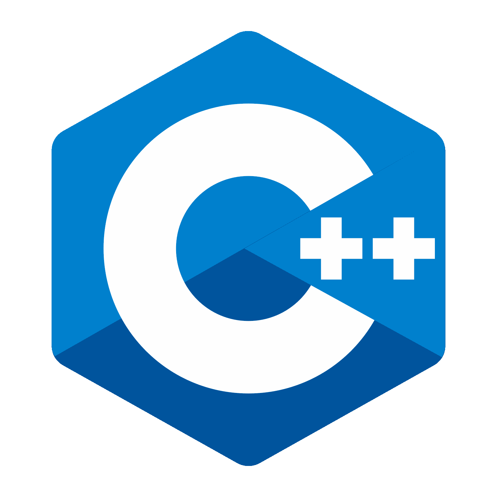

#  Skies9666

## 📃 Introduction
### Hobbiest developer passionate about style and functionality. I am the owner of https://infinity.cx Spaghetti code, errors and bug are my passion!

## ⚙️ Languages and tools

 

### 👨‍🏫👩‍🏫 Currently Expanding my knowledge in...
- PHP
- HTML
- CSS
- C++
- JavaScript

  

  

    Working with code isn't about what you know, it's about how critically you can think to resolve your issues :)

